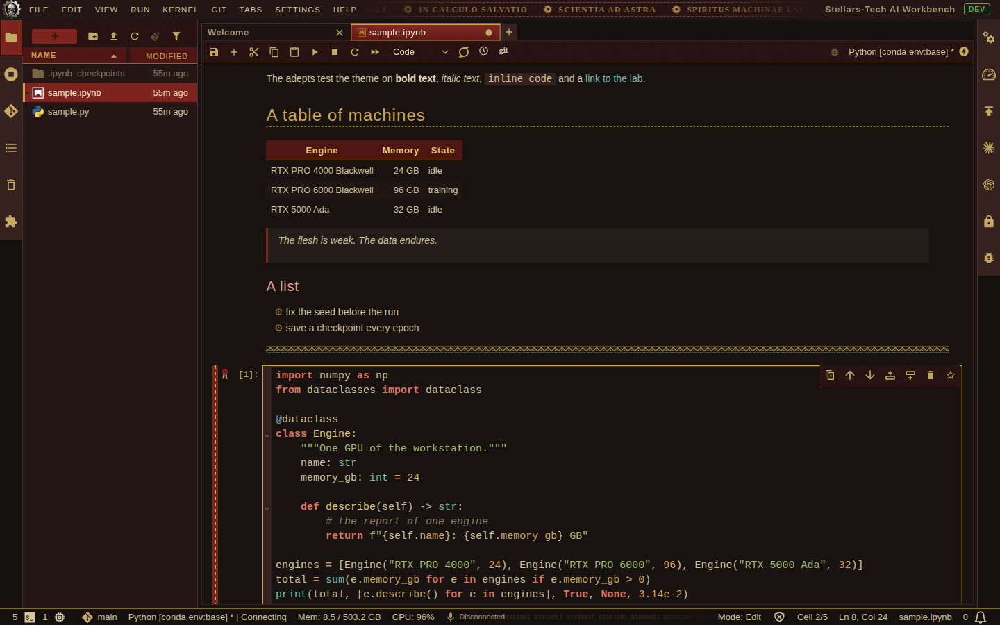
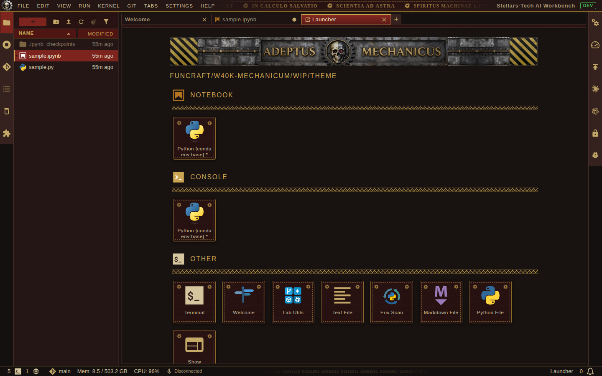

# Mechanicum Dark Theme

[](https://github.com/stellarshenson/jupyterlab_mechanicum_dark_theme/actions/workflows/build.yml)
[](https://www.npmjs.com/package/jupyterlab_mechanicum_dark_theme)
[](https://pypi.org/project/jupyterlab-mechanicum-dark-theme/)
[](https://pepy.tech/project/jupyterlab-mechanicum-dark-theme)
[](https://jupyterlab.readthedocs.io/en/stable/)
[](https://kolomolo.com)
[](https://www.paypal.com/donate/?hosted_button_id=B4KPBJDLLXTSA)

**A dark JupyterLab theme in the look of the Adeptus Mechanicus: crimson cloth, gold embroidery, steel and parchment**

> _From the weakness of the light theme, the Omnissiah delivered us._

> [!WARNING]
> The author does not expect anyone to use this theme for more than 5 minutes. It needs the right mindset.
>
> The author also doubts that this project gets even half a star on GitHub, and expects zero downloads. That is fine.

The flesh is weak, and so are tired eyes. This theme honours the Machine God with as much ornament as one browser tab can carry, and it still lets a tech-priest read code at three in the morning. The machine spirit of JupyterLab has been consulted. It did not object.

The theme dresses the frame of JupyterLab in ornament and leaves the places where you read and write plain. It is a sibling of [jupyterlab_galaxalabs_steel_dark_theme](https://github.com/stellarshenson/jupyterlab_galaxalabs_steel_dark_theme) and has the same project structure.





## Litany against the light theme

> From the glare of the white background, Omnissiah, deliver us.<br>
> From the unpinned dependency, deliver us.<br>
> From the kernel that dies and leaves no traceback, deliver us.<br>
> From the notebook that ran yesterday and does not run today, deliver us.<br>
> From the seed that nobody fixed, deliver us.

Recite it once before a long training run. Recite it twice before a demo.

## What the theme changes

- **Text areas** - the editor, the notebook, the terminal and the file list are flat and nearly black, with parchment-coloured text; the terminal's default text is the grey-green of an old terminal. No pattern lies behind text
- **Panels and toolbars** - crimson cloth with gold stitching
- **Top bar** - the Cog Mechanicum as the icon in the top-left corner, the menu in capitals, and a frieze of Latin mottos in the free middle of the bar
- **Fonts** - the theme sets no font: all text keeps the font of JupyterLab
- **Activity bars** - plain iron; the open panel's icon stands on crimson
- **Tabs of the main area** - the open tab is a crimson banner with a thin gold edge, on a bar of plain iron; the strip under the tab bar continues the banner
- **Launcher** - a thin strip of riveted steel across the top: the Cog Mechanicum, a skull that is half bone and half machine in a gear, between the words `ADEPTUS` and `MECHANICUS` in gold, steel plates with a gold rail beside it and hazard stripes at both ends; section titles over an embroidered band, cards as stitched patches with gears in the corners
- **Notebook** - headings in gold with an embroidered band, a red first letter in the title, gears as list bullets, a crimson ribbon and a purity seal on the active cell
- **Dialogs and menus** - cloth with a stitched hem; a purity seal hangs in the corner of every dialog
- **Status bar** - iron, with `AVE OMNISSIAH` in binary in the free middle of the bar

## Reading comfort

A blinded adept computes nothing. The ornament must not make the lab harder to use. Three rules hold everywhere:

- **Contrast** - every text and code colour has a contrast of 4.8 or more against the editor background; body text has 10 or more, and the terminal's grey-green default text has 8.4
- **No bright areas** - no large area is brighter than the crimson of the cloth. Selected rows are crimson with a gold thread, and no row is a block of gold
- **No motion** - the theme has no animation

| Code element    | Colour                | Contrast on the editor background |
| --------------- | --------------------- | --------------------------------: |
| Text, variables | parchment `#cfc09c`   |                              10.3 |
| Keywords        | rubric red `#dc7560`  |                               6.0 |
| Definitions     | bright gold `#e3c878` |                              11.3 |
| Strings         | olive `#a3b673`       |                               8.4 |
| Numbers         | amber `#dba552`       |                               8.4 |
| Built-ins       | verdigris `#74b9ad`   |                               8.2 |
| Comments        | faded ink `#8f7f66`   |                               4.8 |

## Files

- `style/variables.css` - the colours and sizes of JupyterLab's theme variables
- `style/custom.css` - small corrections of JupyterLab's own styles, shared with the steel theme
- `style/mechanicum.css` - the ornament
- `style/images/` - the images of the ornament. The gear, band, seal, frieze and binary strip are SVG drawings. The three parts of the launcher strip and the emblem of the top bar were designed with the image model Z-Image-Turbo. The hanging and the cloth texture are raster images that were generated for the Mechanicum banner project and reduced for this theme
- `tools/images.py` - generates drafts of the launcher strip and of the emblem with the image model and composes the chosen drafts into the images of the theme. Its head says how to run it. The model misspells words, so every letter of a draft is read before the draft is chosen

## Names and symbols

The theme follows the look of Warhammer 40,000. Its names and symbols belong to Games Workshop. The theme is a fan work and has no connection to Games Workshop.

## Requirements

The machine spirit asks for little:

- JupyterLab >= 4.0.0
- a browser, and a will that does not break at the sight of crimson

## Install

```bash
pip install jupyterlab-mechanicum-dark-theme
```

Then perform the rite of activation:

1. Reload the browser page if JupyterLab was open during the installation. The machine spirit must wake again before it learns of the theme
2. Choose `Settings` → `Theme` → `Mechanicum Dark Theme`
3. Light a candle and apply sacred oil to the keyboard. This step is optional and has no measured effect

## Uninstall

The cult records this act as tech-heresy. The command works all the same:

```bash
pip uninstall jupyterlab-mechanicum-dark-theme
```

## Contributing

### Development install

Note: You will need NodeJS to build the extension package.

- invoke `make` to build the `.whl` package
- invoke `make clean` to run cleanup & uninstall
- invoke `make install` to build and install extension
- invoke `make uninstall` to uninstall extension

`make install` raises the patch number of the version in `package.json` on every build.

The canticle of the build has three verses. Sing them in order:

1. Burn incense before `make install`. If the build fails, burn more incense and read the log
2. Thank the machine spirit when the wheel is built. It did the work
3. Never edit the built files by hand. The Omnissiah sees it, and so does the next build

### Checking a change

Test a change of the styles in JupyterLab before reporting it complete: the launcher, a notebook with rendered Markdown and an error output, a text file in the editor, an open menu, the command palette and a dialog.

---

_Ave Omnissiah. May your kernels never die and your seeds stay fixed._
